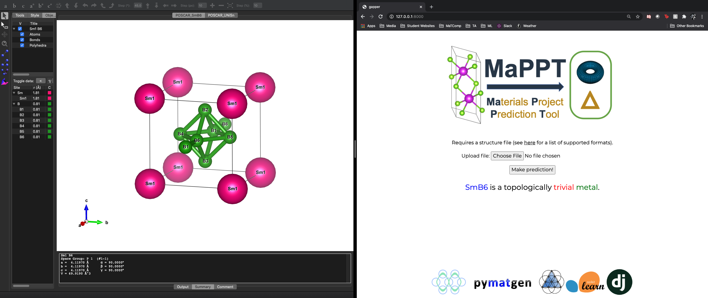
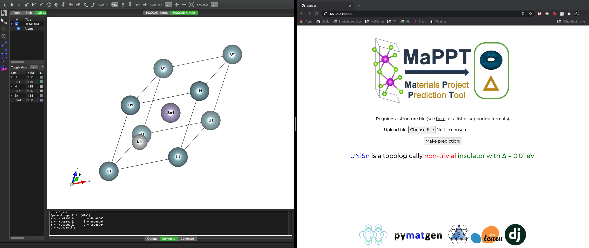

# 
**Ma**terials **P**roject **P**rediction **T**ool

---

The goal of the Materials Project Prediction Tool (MaPPT) is to determine the
basic *electronic* and *topological* characterization of a material based only
on its *crystal structure*. Given a structure file, MaPPT first classifies the
material as insulating or metallic. If the material is an insulator, then MaPPT
predicts the value of the band gap $\Delta$. Finally, the predicted band gap is
included as one of the inputs for classifying the topology (trivial or non-
trivial). The features used for machine learning are based on the work by [Ward
et al. (2017)](https://journals.aps.org/prb/abstract/10.1103/PhysRevB.96.024104)
as implemented in [matminer](https://hackingmaterials.lbl.gov/matminer/).

## MaPPT in action
The left side is a visualization of the crystal structure for [the Kondo
material SmB6](https://arxiv.org/pdf/2003.11052.pdf) using
[VESTA](https://jp-minerals.org/vesta/en/). The right side is a simple web front
end for MaPPT.
 

  

 The website has not been deployed as of 12/3/2020, but the source code will be
uploaded to the [GitHub repo](https://github.com/jkidd1/mappt). Any updates on
development will be posted there. Here's another example: the proposed
[topological material
UNiSn](https://journals.aps.org/prx/pdf/10.1103/PhysRevX.9.041055).
  

## Outline of web backend

## Current performance*
| Estimator | Error |
| ----------- | ----------- |
| Classifier 1: Insulator/metal | 11% |
| Classifier 2: Topology | 10% |
| Regressor: Band gap | 0.565 eV |

*As determined by test set predictions. For classification, error is the
percentage of materials that are misclassified. For regression, error is the
mean absolute error.

## Layout
This project is organized as follows:
- `./images` contains the pictures used in this `README`.
- `dataset.ipynb` is used to generate the training and testing data for all 3
models. The final dataframes are written to CSV files and stored in `./data`
- `./models` contains the notebooks used to train each model:
    - `classifier1.ipynb` for insulator/metal
    - `classifier2.ipynb` for topology
    - `regressor.ipynb` for band gap
- `./jar` contains the `pickle` files for the models generated by the training
notebooks. However, because it is [not
recommended](https://wiki.python.org/moin/UsingPickle) to send `pickle` files
over a network, they are excluded from this submission. They are still available
upon request.
- `performance.ipynb` is used to load the models and study their accuracy.

##### Note: due to runtime, many calculations were submitted as jobs to HPC clusters.
**All HPC input and output files (e.g., SLURM scripts) will be made available upon request.**
